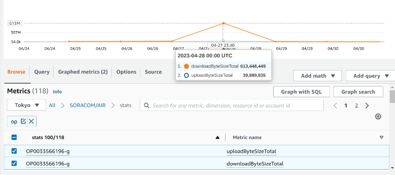

# soracom-stats-monitor

A CDK Stack to deploy AWS Lambda to collect [data usage of Soracom SIMs](https://developers.soracom.io/en/docs/air/data-usage/) with groups wide and operators wide.

The data will be stored on Amazon CloudWatch.


## Synopsis

```bash
cd cdk
cdk deploy
```

The command above will deploy AWS lambda function to collect data usage from Soracom using [getAirStatsOfOperator](https://developers.soracom.io/en/api/#!/Stats/getAirStatsOfOperator) and [getAirStatsOfGroup](https://developers.soracom.io/en/api/#!/Stats/getAirStatsOfGroup) APIs. The lambda function will be invoked 0:05AM every day by using AWS EventBridge trigger(this configuration will be deployed too)

To make it work, you have to provide your Soracom credential in the form of below. The CDK Stack will create a secret in AWS SecretManager prefixed SoracomStatsMonitroSoracom. Please paste your crecential into it.

```json
{
  "coverageType": "g",
  "authKeyId": "keyId-xxxxxx",
  "authKey": "secret-xxxxx",
  "operatorId": "OPxxxxx"
}
```
